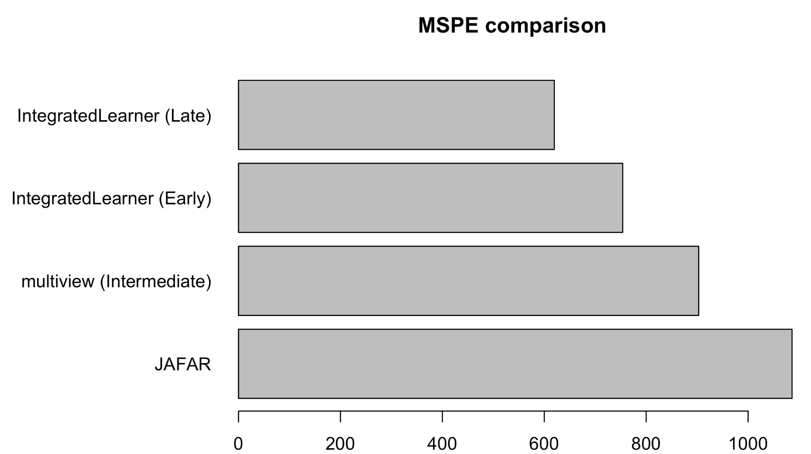

# Multi-omics Data Integration for Biomedical Prediction and Microbiome Meta-analysis

## Overview

This project explores multiple strategies for integrating high-dimensional multi-omics data in biomedical research, with applications in pregnancy outcome prediction, cancer microbiome meta-analysis, and inflammatory bowel disease (IBD) classification.

The main objective is to compare different integration frameworks—including early integration, intermediate integration, late integration, Bayesian hierarchical modeling, and latent factor models—to evaluate both predictive performance and biological interpretability.

The analyses were conducted using real-world datasets from pregnancy multi-omics studies, cancer microbiome cohorts, and the iHMP IBDMDB project.

---

## Project Structure

### Problem 1 — Vertical Integration of Pregnancy Multi-omics Data

Dataset:

* CYTOF
* Proteomics

Goal:

Predict pregnancy-related outcomes using multiple omics layers.

Methods compared:

* Early integration (feature concatenation)
* Late integration (`IntegratedLearner`)
* Intermediate integration (`multiview`)
* Bayesian integration (`BayesCOOP`)
* Joint latent factor model (`JAFAR`)

### Key Result

Late integration using `IntegratedLearner` achieved the best predictive performance:

**MSPE = 619.62**

## Performance Comparison Across Integration Methods

This suggests that model-level integration outperforms direct feature concatenation for this prediction task.

---

### Problem 2 — Cancer Microbiome Pathway Meta-analysis

Dataset:

`curatedMetagenomicData`

Studies included:

* FrankelAE_2017
* GopalakrishnanV_2018
* LeeKA_2022
* MatsonV_2018
* PetersBA_2019
* WindTT_2020

Goal:

Identify microbial pathways associated with immunotherapy response.

Methods:

* pathway abundance preprocessing
* MMUPHin batch correction
* PERMANOVA
* PCoA visualization
* meta-analytic differential abundance testing

### Key Result

Batch correction substantially reduced study-specific variation:

**PERMANOVA R²: 0.2289 → 0.1273**

Several biologically meaningful pathways were identified as significantly associated with treatment response.

---

### Problem 3 — Diagonal Integration of iHMP Data

Dataset:

iHMP IBDMDB

Goal:

Classify:

* IBD
* non-IBD

Methods:

* species abundance profiling
* pathway abundance profiling
* MaAsLin2 mixed-effects modeling
* subject-level random effect extraction
* supervised prediction using random effects

This framework captures longitudinal subject-specific microbiome variation through mixed-effects modeling.

---

### Problem 4 — MOFA+ Factors to Supervised Prediction

Goal:

Compare:

* raw omics features
* latent factor representations from MOFA+

Methods:

* MOFA+ unsupervised factor extraction
* projection into latent factor space
* IntegratedLearner prediction using factor scores

### Key Result

Raw feature late integration remained superior:

* Raw features (Late): **MSPE = 619.62**
* MOFA factors (Late): **MSPE = 1121.19**

This indicates that latent factor compression improves interpretability but may reduce predictive accuracy.

---

## Main Packages

* IntegratedLearner
* BayesCOOP
* multiview
* JAFAR
* MMUPHin
* MaAsLin2
* MOFA2
* curatedMetagenomicData
* lme4
* SuperLearner
* caret
* vegan
* tidyverse

---

## Key Takeaways

This project demonstrates that:

* Late integration often provides the strongest predictive performance
* Batch correction is essential for multi-study microbiome meta-analysis
* Mixed-effects models help capture subject-level heterogeneity
* Latent factor models improve interpretability but may sacrifice prediction accuracy

These findings highlight practical considerations when selecting multi-omics integration strategies for translational biomedical research.

---

## Author

Ranxuan Li

MS in Biostatistics and Data Science
Weill Cornell Medicine
